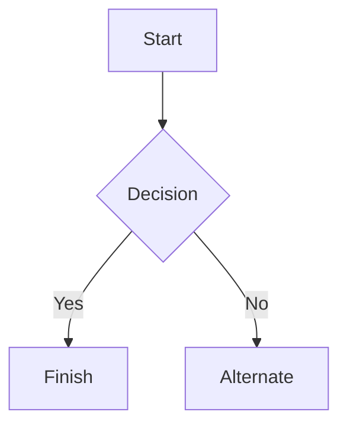

# Markdown syntax guide

# Prompt Engineering Portfolio
Name: Ekta Vijay Tiwari
Date: 4th Jun 2026
LLM Used: ChatGPT-4


## Part 1: Prompt Design & Iteration

## 1.1 Scenario A: Technical Explanation

#### Goal : Explain recursion to a 10-year-old.

#### Initial Prompt
```
Explain recursion to a 10-year-old.
```
#### Refined Prompt
##### Iteration 1:
```
Explain recursion to a 10-year-old using simple language and a real-life example. Avoid technical terms and keep the explanation under 150 words.
```
##### Iteration 2:
```
You are an expert elementary school teacher who specializes in explaining computer science concepts to children.
I am teaching a group of 10-year-olds who have never done any programming before.

Explain recursion using a fun story. Avoid technical jargon, use simple language, explain why recursion eventually stops, and keep the explanation between 150 and 200 words.

```

#### Final Output:
```
You are an expert elementary school teacher who specializes in explaining computer science concepts to children.

I am teaching a group of 10-year-olds who have never done any programming before.

Explain recursion using a fun story. Avoid technical jargon, use simple language, explain why recursion eventually stops, and keep the explanation between 150 and 200 words.
```


### 1.2 Iteration Documentation - Scenario A: Technical Explanation

| Version | Prompt | What Changed | Why This Improved the Output |
|----------|----------|----------|----------|
| V1 | `Explain recursion to a 10-year-old.` | N/A | N/A |
| V2 | `Explain recursion to a 10-year-old using simple language and a real-life example. Avoid technical terms and keep the explanation under 150 words.` | Added instructions to use simple language, include a real-life example, avoid technical jargon, and limit the response length. | The output became easier for a child to understand and more focused on the target audience. |
| V3 | `You are an expert elementary school teacher who specializes in explaining computer science concepts to children. I am teaching a group of 10-year-olds who have never done any programming before. Explain recursion using a fun story. Avoid technical jargon, use simple language, explain why recursion eventually stops, and keep the explanation between 150 and 200 words.` | Added role assignment, audience context, story-based format, explanation of the stopping condition, and a more specific output structure. | The output became more engaging, age-appropriate, and educational. The role and context helped the model tailor the explanation to the needs of young learners. |


### 1.3 Role and Context Usage:

##### Role Assignment:

"You are an expert elementary school teacher..."

##### Context Setting:

"I am teaching a group of 10-year-olds who have never done any programming before."


----

## 1.1 Scenario B: Professional Email

#### Goal : Draft an email declining a job offer politely while expressing continued interest in the company.

#### Initial Prompt
```
Write an email declining a job offer.
```
#### Refined Prompt
##### Iteration 1:
```
Explain recursion to a 10-year-old using simple language and a real-life example. Avoid technical terms and keep the explanation under 150 words.
```
##### Iteration 2:
```
You are an expert elementary school teacher who specializes in explaining computer science concepts to children.
I am teaching a group of 10-year-olds who have never done any programming before.

Explain recursion using a fun story. Avoid technical jargon, use simple language, explain why recursion eventually stops, and keep the explanation between 150 and 200 words.

```

#### Final Output:
```
You are an expert elementary school teacher who specializes in explaining computer science concepts to children.

I am teaching a group of 10-year-olds who have never done any programming before.

Explain recursion using a fun story. Avoid technical jargon, use simple language, explain why recursion eventually stops, and keep the explanation between 150 and 200 words.
```


### 1.2 Iteration Documentation - Scenario A: Technical Explanation

| Version | Prompt | What Changed | Why This Improved the Output |
|----------|----------|----------|----------|
| V1 | `Explain recursion to a 10-year-old.` | N/A | N/A |
| V2 | `Explain recursion to a 10-year-old using simple language and a real-life example. Avoid technical terms and keep the explanation under 150 words.` | Added instructions to use simple language, include a real-life example, avoid technical jargon, and limit the response length. | The output became easier for a child to understand and more focused on the target audience. |
| V3 | `You are an expert elementary school teacher who specializes in explaining computer science concepts to children. I am teaching a group of 10-year-olds who have never done any programming before. Explain recursion using a fun story. Avoid technical jargon, use simple language, explain why recursion eventually stops, and keep the explanation between 150 and 200 words.` | Added role assignment, audience context, story-based format, explanation of the stopping condition, and a more specific output structure. | The output became more engaging, age-appropriate, and educational. The role and context helped the model tailor the explanation to the needs of young learners. |


### 1.3 Role and Context Usage:

##### Role Assignment:

"You are an expert elementary school teacher..."

##### Context Setting:

"I am teaching a group of 10-year-olds who have never done any programming before."


----


Imagine you're standing between two mirrors facing each other.

You see yourself in the mirror, and inside that reflection, you see another reflection, and inside that one, another reflection, and so on. The same thing keeps appearing again and again, just a little smaller each time.

That's similar to **recursion**.


### A Simple Example: Russian Nesting Dolls

Think of a big doll that contains a smaller doll. Inside that smaller doll is an even smaller doll, and so on.

To find the tiniest doll, you would:

1. Open the big doll.
2. Open the doll inside it.
3. Open the next doll.
4. Keep doing the same thing...
5. Until you reach the smallest doll that can't be opened.

Recursion works the same way:

- A function solves a problem by asking a **smaller version of itself** to solve part of the problem.
- Eventually, it reaches a **stopping point** (the smallest doll), so it doesn't go on forever.

### Example: Counting Down

Suppose we want to count down from 5.

```text
5
4
3
2
1
Done!
```

A recursive way to think about it is:

- To count down from 5:
  - Say "5"
  - Ask yourself to count down from 4
- To count down from 4:
  - Say "4"
  - Ask yourself to count down from 3
- And so on...

When you reach 1:

- Say "1"
- Say "Done!"
- Stop

### Why Do We Need the Stop?

Imagine if you kept opening dolls but there was never a smallest doll. You'd keep opening forever!

In recursion, the stopping point is called the **base case**. Without it, the computer would keep repeating the same process forever.

### One-Sentence Definition

**Recursion is when something solves a problem by using a smaller version of itself, until it reaches a stopping point.**


***********************************************************************************************
### Emphasis

*This text will be italic*  
_This will also be italic_

**This text will be bold**  
__This will also be bold__

_You **can** combine them_

## Lists

### Unordered

* Item 1
* Item 2
* Item 2a
* Item 2b
    * Item 3a
    * Item 3b

### Ordered

1. Item 1
2. Item 2
3. Item 3
    1. Item 3a
    2. Item 3b

## Images


## Links

You may be using [Markdown Live Preview](https://markdownlivepreview.com/).

## Blockquotes

> Markdown is a lightweight markup language with plain-text-formatting syntax, created in 2004 by John Gruber with Aaron Swartz.
>
>> Markdown is often used to format readme files, for writing messages in online discussion forums, and to create rich text using a plain text editor.

## Tables

| Left columns  | Right columns |
| ------------- |:-------------:|
| left foo      | right foo     |
| left bar      | right bar     |
| left baz      | right baz     |

## Blocks of code

```
let message = 'Hello world';
alert(message);
```

## Mermaid diagrams


## Inline code

This web site is using `markedjs/marked`.
